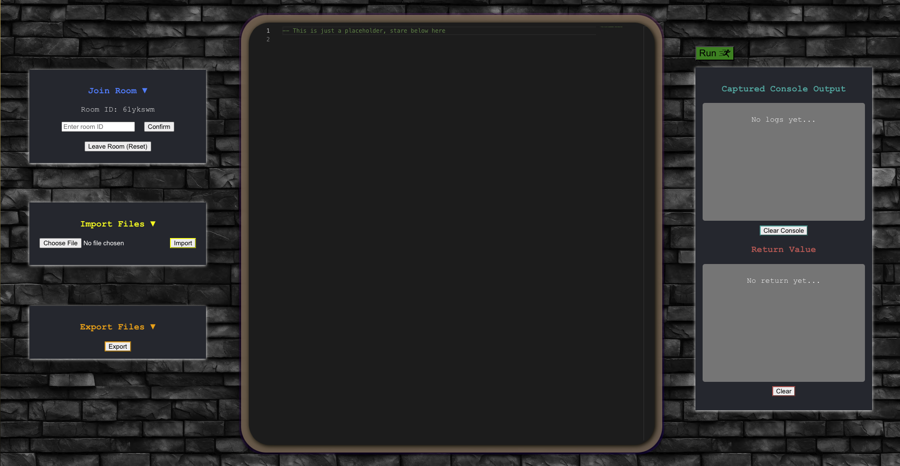
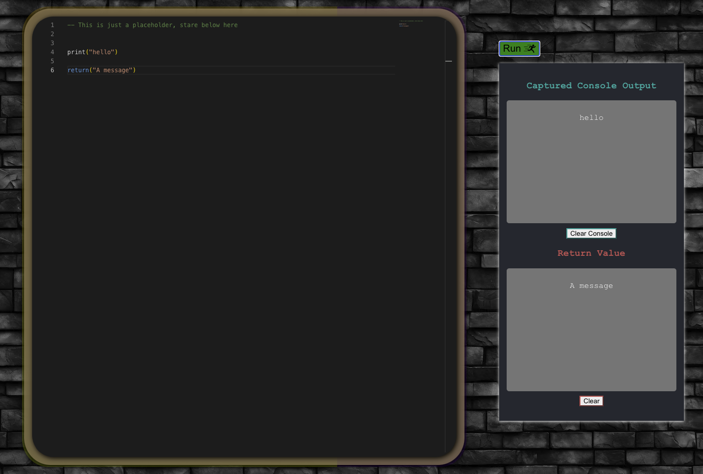
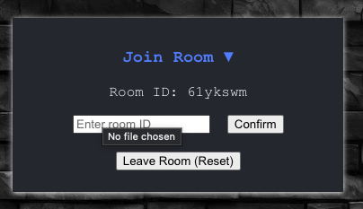
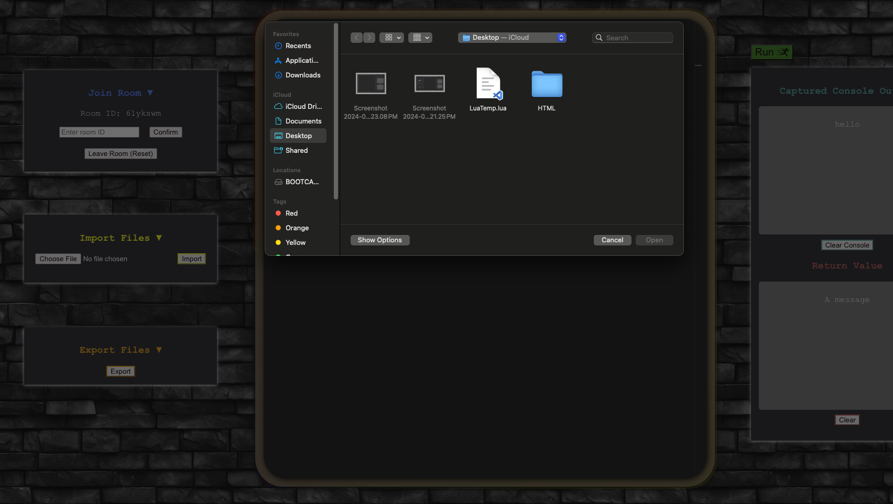
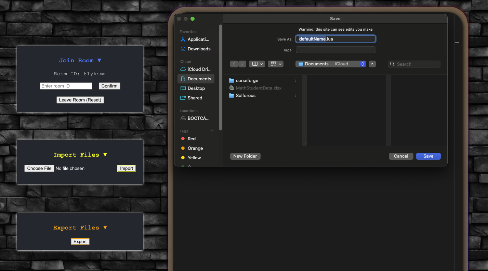

# Roblox Live Edit - Collaborative Lua Coding Environment

**Frontend**: `roblox-live-edit`  - run `npm start`

**Backend**: `backend`  - run `node index.js`

This project provides a collaborative, real-time code editing environment for Roblox developers using Lua. It allows users to write, edit, and run code in a homemade console, and it facilitates collaboration via a WebSocket connection.

## Features

- **Real-Time Collaboration**: Multiple users can join a session to write and edit Lua scripts together in real-time.
- **WebSocket Environment**: The program utilizes WebSockets for seamless and instant communication between users.
- **Custom Console**: Includes a homemade console for running scripts and viewing output.
- **File Management**: Users can import and export Lua files to work on existing projects or save progress.
- **Room-Based Collaboration**: Create or join rooms to collaborate with others on different projects.
- **Code Execution**: Instantly run Lua code within the collaborative environment and see the output in real-time.
- **Live Updates**: All changes are synchronized in real-time, so everyone in the session sees updates as they happen.
  
## Images






## Goals

- **Code Cleanup**: Regular maintenance to ensure clean and efficient code, with well-documented functions and clear docstrings.
- **Efficient Data Handling**: Streamlined the data handling processes to reduce latency and ensure smooth collaboration.
- **Enhanced Error Handling**: Added comprehensive error handling to improve the robustness of the platform during real-time interactions.
- **Modularized Code**: Refactored larger components into smaller, reusable modules to enhance scalability and maintainability.
- **UI Enhancements**: Continual improvements to the UI for an intuitive and seamless user experience.

## Development

- **React Frontend**: Built using React to create a responsive, real-time collaborative environment for users.
- **Node.js Backend**: Manages WebSocket connections and backend logic, ensuring smooth communication between users and the server.
- **WebSocket Integration**: Real-time communication powered by Socket.io for instant updates and interaction.
- **File Import/Export**: Easy file management allowing users to load existing Lua files into the editor and export files for offline work.

## Setup & Usage

1. **Clone the Repository**:
   ```bash
   git clone https://github.com/Mtkurilko/roblox-live-edit.git

2. **Install Frontend Dependencies**:
Navigate to the frontend directory and install dependencies:
   ```bash
   cd roblox-live-edit
   npm install
   
3. **Install Backend Dependencies**:
Navigate to the backend directory and install dependencies:
   ```bash
   cd backend
   npm install
   
4. **Run the Frontend**:
In the roblox-live-edit directory, start the React frontend:
   ```bash
   npm start
   
5. **Run the Backend**:
In the backend directory, start the Node.js server:
   ```bash
   node index.js

6. **Join a Room**:
Navigate to the console in your browser, where you can create or join a collaborative room with other users.

7. **Collaborate**:
Start editing Lua code together in real-time. Any changes you make are instantly synchronized across all connected users.